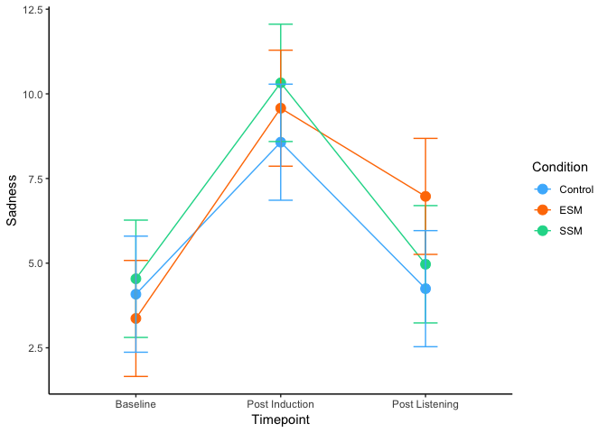

Study 1
================
Joel Larwood
04 June, 2019

# Study 1 Analysis

## Set up and load data

``` r
library(tidyverse)
library(interactions)
library(sjPlot)
library(psych)
library(knitr)
library(kableExtra)
library(lmerTest)
library(expss)
```

``` r
study1 <- read_csv("RMER_Study1.csv") %>% select(id,
                                                 Age,
                                                 Gender,
                                                 Sample,
                                                 Condition,
                                                 contains("POMS"),
                                                 contains("RRQ"),
                                                 contains("self"),
                                                 contains("pop"),
                                                 contains("ness"),
                                                 valence,
                                                 mode,
                                                 energy,
                                                 tempo,
                                                 key,
                                                 danceability,
                                                 contains("music"))
names(study1)
```

    ##  [1] "id"                 "Age"                "Gender"            
    ##  [4] "Sample"             "Condition"          "POMSDSF1_1"        
    ##  [7] "POMSDSF2_1"         "POMSDSF3_1"         "POMSDSF4_1"        
    ## [10] "POMSDSF5_1"         "POMSDSF6_1"         "POMSDSF7_1"        
    ## [13] "POMSDSF8_1"         "POMSDSF1_2"         "POMSDSF2_2"        
    ## [16] "POMSDSF3_2"         "POMSDSF4_2"         "POMSDSF5_2"        
    ## [19] "POMSDSF6_2"         "POMSDSF7_2"         "POMSDSF8_2"        
    ## [22] "POMSDSF1_3"         "POMSDSF2_3"         "POMSDSF3_3"        
    ## [25] "POMSDSF4_3"         "POMSDSF5_3"         "POMSDSF6_3"        
    ## [28] "POMSDSF7_3"         "POMSDSF8_3"         "RRQ1_1"            
    ## [31] "RRQ2_1"             "RRQ3_1"             "RRQ4_1"            
    ## [34] "RRQ5_1"             "RRQ6_1"             "RRQ7_1"            
    ## [37] "RRQ8_1"             "RRQ9_1"             "RRQ10_1"           
    ## [40] "RRQ11_1"            "RRQ12_1"            "RRQ6r"             
    ## [43] "RRQ9r"              "RRQ10r"             "SelfSelected_Song1"
    ## [46] "SelfSelected_Song2" "track_popularity"   "loudness"          
    ## [49] "speechiness"        "acousticness"       "instrumentalness"  
    ## [52] "liveness"           "valence"            "mode"              
    ## [55] "energy"             "tempo"              "key"               
    ## [58] "danceability"       "MusicInfo4_1"

## Create Scores

``` r
study1 <- study1 %>% mutate(Baseline = rowSums(select(., POMSDSF1_1:POMSDSF8_1)),
                            Post_induction = rowSums(select(., POMSDSF1_2:POMSDSF8_2)),
                            Post_listening = rowSums(select(., POMSDSF1_3:POMSDSF8_3)),
                            Rumination = (RRQ1_1 + RRQ2_1 + RRQ3_1 + RRQ4_1 + RRQ5_1 + (6 - RRQ6_1) + RRQ7_1 + RRQ8_1 + (6 - RRQ9_1) + (6 - RRQ10_1) +RRQ11_1 + RRQ12_1)/12)
names(study1)
```

    ##  [1] "id"                 "Age"                "Gender"            
    ##  [4] "Sample"             "Condition"          "POMSDSF1_1"        
    ##  [7] "POMSDSF2_1"         "POMSDSF3_1"         "POMSDSF4_1"        
    ## [10] "POMSDSF5_1"         "POMSDSF6_1"         "POMSDSF7_1"        
    ## [13] "POMSDSF8_1"         "POMSDSF1_2"         "POMSDSF2_2"        
    ## [16] "POMSDSF3_2"         "POMSDSF4_2"         "POMSDSF5_2"        
    ## [19] "POMSDSF6_2"         "POMSDSF7_2"         "POMSDSF8_2"        
    ## [22] "POMSDSF1_3"         "POMSDSF2_3"         "POMSDSF3_3"        
    ## [25] "POMSDSF4_3"         "POMSDSF5_3"         "POMSDSF6_3"        
    ## [28] "POMSDSF7_3"         "POMSDSF8_3"         "RRQ1_1"            
    ## [31] "RRQ2_1"             "RRQ3_1"             "RRQ4_1"            
    ## [34] "RRQ5_1"             "RRQ6_1"             "RRQ7_1"            
    ## [37] "RRQ8_1"             "RRQ9_1"             "RRQ10_1"           
    ## [40] "RRQ11_1"            "RRQ12_1"            "RRQ6r"             
    ## [43] "RRQ9r"              "RRQ10r"             "SelfSelected_Song1"
    ## [46] "SelfSelected_Song2" "track_popularity"   "loudness"          
    ## [49] "speechiness"        "acousticness"       "instrumentalness"  
    ## [52] "liveness"           "valence"            "mode"              
    ## [55] "energy"             "tempo"              "key"               
    ## [58] "danceability"       "MusicInfo4_1"       "Baseline"          
    ## [61] "Post_induction"     "Post_listening"     "Rumination"

``` r
describe(select(study1, 
                Baseline,
                contains("Post"),
                Rumination)) %>% select(-vars,
                                        -trimmed,
                                        -mad,
                                        -range) %>% round(digits = 3)
```

    ##                  n mean   sd median  min max  skew kurtosis   se
    ## Baseline       128 3.99 5.09   2.00 0.00  26  1.84     3.43 0.45
    ## Post_induction 128 9.48 6.70   8.00 0.00  27  0.89    -0.10 0.59
    ## Post_listening 128 5.40 6.12   4.00 0.00  30  1.66     2.44 0.54
    ## Rumination     128 3.70 0.62   3.83 2.17   5 -0.35    -0.02 0.06

## Create Long data

``` r
S1long <- gather(data = study1,
                 key = Timepoint,
                 value = Sadness,
                 Baseline, Post_induction, Post_listening) %>% select(-contains("POMS"), -contains("RRQ"))


S1long <- S1long %>% mutate(Timepoint = as.factor(.$Timepoint),
                            id = as.factor(.$id),
                            Condition = as.factor(.$Condition))

write_csv(S1long, "RMER_Study1_long.csv")
```

## Test Hypothesis

### Set up models

``` r
timecondint <- lmer(Sadness~1+Timepoint*Condition+(1|id), data = S1long)
timecondintrum <- update(timecondint, .~. + Rumination)
all <- update(timecondintrum, .~. +Timepoint*Condition*Rumination)


anova(timecondint, timecondintrum, all)
```

    ## refitting model(s) with ML (instead of REML)

    ## Data: S1long
    ## Models:
    ## timecondint: Sadness ~ 1 + Timepoint * Condition + (1 | id)
    ## timecondintrum: Sadness ~ Timepoint + Condition + (1 | id) + Rumination + Timepoint:Condition
    ## all: Sadness ~ Timepoint + Condition + (1 | id) + Rumination + Timepoint:Condition + 
    ## all:     Timepoint:Rumination + Condition:Rumination + Timepoint:Condition:Rumination
    ##                Df    AIC    BIC  logLik deviance   Chisq Chi Df Pr(>Chisq)
    ## timecondint    11 2369.5 2413.0 -1173.8   2347.5                          
    ## timecondintrum 12 2352.9 2400.3 -1164.4   2328.9 18.6525      1  1.568e-05
    ## all            20 2366.5 2445.5 -1163.2   2326.5  2.4162      8     0.9655
    ##                   
    ## timecondint       
    ## timecondintrum ***
    ## all               
    ## ---
    ## Signif. codes:  0 '***' 0.001 '**' 0.01 '*' 0.05 '.' 0.1 ' ' 1

``` r
tab_model(timecondint, timecondintrum, all)
```

<table style="border-collapse:collapse; border:none;">

<tr>

<th style="border-top: double; text-align:center; font-style:normal; font-weight:bold; padding:0.2cm;  text-align:left; ">

 

</th>

<th colspan="3" style="border-top: double; text-align:center; font-style:normal; font-weight:bold; padding:0.2cm; ">

Sadness

</th>

<th colspan="3" style="border-top: double; text-align:center; font-style:normal; font-weight:bold; padding:0.2cm; ">

Sadness

</th>

<th colspan="3" style="border-top: double; text-align:center; font-style:normal; font-weight:bold; padding:0.2cm; ">

Sadness

</th>

</tr>

<tr>

<td style=" text-align:center; border-bottom:1px solid; font-style:italic; font-weight:normal;  text-align:left; ">

Predictors

</td>

<td style=" text-align:center; border-bottom:1px solid; font-style:italic; font-weight:normal;  ">

Estimates

</td>

<td style=" text-align:center; border-bottom:1px solid; font-style:italic; font-weight:normal;  ">

CI

</td>

<td style=" text-align:center; border-bottom:1px solid; font-style:italic; font-weight:normal;  ">

p

</td>

<td style=" text-align:center; border-bottom:1px solid; font-style:italic; font-weight:normal;  ">

Estimates

</td>

<td style=" text-align:center; border-bottom:1px solid; font-style:italic; font-weight:normal;  ">

CI

</td>

<td style=" text-align:center; border-bottom:1px solid; font-style:italic; font-weight:normal;  col7">

p

</td>

<td style=" text-align:center; border-bottom:1px solid; font-style:italic; font-weight:normal;  col8">

Estimates

</td>

<td style=" text-align:center; border-bottom:1px solid; font-style:italic; font-weight:normal;  col9">

CI

</td>

<td style=" text-align:center; border-bottom:1px solid; font-style:italic; font-weight:normal;  0">

p

</td>

</tr>

<tr>

<td style=" padding:0.2cm; text-align:left; vertical-align:top; text-align:left; ">

(Intercept)

</td>

<td style=" padding:0.2cm; text-align:left; vertical-align:top; text-align:center;  ">

3.88

</td>

<td style=" padding:0.2cm; text-align:left; vertical-align:top; text-align:center;  ">

2.10 – 5.67

</td>

<td style=" padding:0.2cm; text-align:left; vertical-align:top; text-align:center;  ">

<strong>\<0.001

</td>

<td style=" padding:0.2cm; text-align:left; vertical-align:top; text-align:center;  ">

\-6.89

</td>

<td style=" padding:0.2cm; text-align:left; vertical-align:top; text-align:center;  ">

\-11.97 – -1.81

</td>

<td style=" padding:0.2cm; text-align:left; vertical-align:top; text-align:center;  col7">

<strong>0.009</strong>

</td>

<td style=" padding:0.2cm; text-align:left; vertical-align:top; text-align:center;  col8">

\-4.53

</td>

<td style=" padding:0.2cm; text-align:left; vertical-align:top; text-align:center;  col9">

\-13.78 – 4.72

</td>

<td style=" padding:0.2cm; text-align:left; vertical-align:top; text-align:center;  0">

0.338

</td>

</tr>

<tr>

<td style=" padding:0.2cm; text-align:left; vertical-align:top; text-align:left; ">

Post induction

</td>

<td style=" padding:0.2cm; text-align:left; vertical-align:top; text-align:center;  ">

4.49

</td>

<td style=" padding:0.2cm; text-align:left; vertical-align:top; text-align:center;  ">

2.78 – 6.20

</td>

<td style=" padding:0.2cm; text-align:left; vertical-align:top; text-align:center;  ">

<strong>\<0.001

</td>

<td style=" padding:0.2cm; text-align:left; vertical-align:top; text-align:center;  ">

4.49

</td>

<td style=" padding:0.2cm; text-align:left; vertical-align:top; text-align:center;  ">

2.78 – 6.20

</td>

<td style=" padding:0.2cm; text-align:left; vertical-align:top; text-align:center;  col7">

<strong>\<0.001

</td>

<td style=" padding:0.2cm; text-align:left; vertical-align:top; text-align:center;  col8">

0.10

</td>

<td style=" padding:0.2cm; text-align:left; vertical-align:top; text-align:center;  col9">

\-9.17 – 9.37

</td>

<td style=" padding:0.2cm; text-align:left; vertical-align:top; text-align:center;  0">

0.983

</td>

</tr>

<tr>

<td style=" padding:0.2cm; text-align:left; vertical-align:top; text-align:left; ">

Post listening

</td>

<td style=" padding:0.2cm; text-align:left; vertical-align:top; text-align:center;  ">

0.16

</td>

<td style=" padding:0.2cm; text-align:left; vertical-align:top; text-align:center;  ">

\-1.54 – 1.87

</td>

<td style=" padding:0.2cm; text-align:left; vertical-align:top; text-align:center;  ">

0.852

</td>

<td style=" padding:0.2cm; text-align:left; vertical-align:top; text-align:center;  ">

0.16

</td>

<td style=" padding:0.2cm; text-align:left; vertical-align:top; text-align:center;  ">

\-1.54 – 1.87

</td>

<td style=" padding:0.2cm; text-align:left; vertical-align:top; text-align:center;  col7">

0.852

</td>

<td style=" padding:0.2cm; text-align:left; vertical-align:top; text-align:center;  col8">

\-0.54

</td>

<td style=" padding:0.2cm; text-align:left; vertical-align:top; text-align:center;  col9">

\-9.82 – 8.73

</td>

<td style=" padding:0.2cm; text-align:left; vertical-align:top; text-align:center;  0">

0.908

</td>

</tr>

<tr>

<td style=" padding:0.2cm; text-align:left; vertical-align:top; text-align:left; ">

ESM

</td>

<td style=" padding:0.2cm; text-align:left; vertical-align:top; text-align:center;  ">

\-0.37

</td>

<td style=" padding:0.2cm; text-align:left; vertical-align:top; text-align:center;  ">

\-2.90 – 2.16

</td>

<td style=" padding:0.2cm; text-align:left; vertical-align:top; text-align:center;  ">

0.773

</td>

<td style=" padding:0.2cm; text-align:left; vertical-align:top; text-align:center;  ">

\-0.72

</td>

<td style=" padding:0.2cm; text-align:left; vertical-align:top; text-align:center;  ">

\-3.13 – 1.70

</td>

<td style=" padding:0.2cm; text-align:left; vertical-align:top; text-align:center;  col7">

0.562

</td>

<td style=" padding:0.2cm; text-align:left; vertical-align:top; text-align:center;  col8">

\-2.74

</td>

<td style=" padding:0.2cm; text-align:left; vertical-align:top; text-align:center;  col9">

\-17.88 – 12.39

</td>

<td style=" padding:0.2cm; text-align:left; vertical-align:top; text-align:center;  0">

0.723

</td>

</tr>

<tr>

<td style=" padding:0.2cm; text-align:left; vertical-align:top; text-align:left; ">

SSM

</td>

<td style=" padding:0.2cm; text-align:left; vertical-align:top; text-align:center;  ">

0.71

</td>

<td style=" padding:0.2cm; text-align:left; vertical-align:top; text-align:center;  ">

\-1.83 – 3.26

</td>

<td style=" padding:0.2cm; text-align:left; vertical-align:top; text-align:center;  ">

0.584

</td>

<td style=" padding:0.2cm; text-align:left; vertical-align:top; text-align:center;  ">

0.45

</td>

<td style=" padding:0.2cm; text-align:left; vertical-align:top; text-align:center;  ">

\-1.98 – 2.89

</td>

<td style=" padding:0.2cm; text-align:left; vertical-align:top; text-align:center;  col7">

0.714

</td>

<td style=" padding:0.2cm; text-align:left; vertical-align:top; text-align:center;  col8">

\-5.96

</td>

<td style=" padding:0.2cm; text-align:left; vertical-align:top; text-align:center;  col9">

\-20.27 – 8.35

</td>

<td style=" padding:0.2cm; text-align:left; vertical-align:top; text-align:center;  0">

0.415

</td>

</tr>

<tr>

<td style=" padding:0.2cm; text-align:left; vertical-align:top; text-align:left; ">

TimepointPost\_induction:ConditionESM

</td>

<td style=" padding:0.2cm; text-align:left; vertical-align:top; text-align:center;  ">

1.72

</td>

<td style=" padding:0.2cm; text-align:left; vertical-align:top; text-align:center;  ">

\-0.69 – 4.13

</td>

<td style=" padding:0.2cm; text-align:left; vertical-align:top; text-align:center;  ">

0.164

</td>

<td style=" padding:0.2cm; text-align:left; vertical-align:top; text-align:center;  ">

1.72

</td>

<td style=" padding:0.2cm; text-align:left; vertical-align:top; text-align:center;  ">

\-0.69 – 4.13

</td>

<td style=" padding:0.2cm; text-align:left; vertical-align:top; text-align:center;  col7">

0.164

</td>

<td style=" padding:0.2cm; text-align:left; vertical-align:top; text-align:center;  col8">

8.88

</td>

<td style=" padding:0.2cm; text-align:left; vertical-align:top; text-align:center;  col9">

\-6.30 – 24.05

</td>

<td style=" padding:0.2cm; text-align:left; vertical-align:top; text-align:center;  0">

0.253

</td>

</tr>

<tr>

<td style=" padding:0.2cm; text-align:left; vertical-align:top; text-align:left; ">

TimepointPost\_listening:ConditionESM

</td>

<td style=" padding:0.2cm; text-align:left; vertical-align:top; text-align:center;  ">

3.44

</td>

<td style=" padding:0.2cm; text-align:left; vertical-align:top; text-align:center;  ">

1.03 – 5.86

</td>

<td style=" padding:0.2cm; text-align:left; vertical-align:top; text-align:center;  ">

<strong>0.006</strong>

</td>

<td style=" padding:0.2cm; text-align:left; vertical-align:top; text-align:center;  ">

3.44

</td>

<td style=" padding:0.2cm; text-align:left; vertical-align:top; text-align:center;  ">

1.03 – 5.86

</td>

<td style=" padding:0.2cm; text-align:left; vertical-align:top; text-align:center;  col7">

<strong>0.006</strong>

</td>

<td style=" padding:0.2cm; text-align:left; vertical-align:top; text-align:center;  col8">

7.45

</td>

<td style=" padding:0.2cm; text-align:left; vertical-align:top; text-align:center;  col9">

\-7.72 – 22.63

</td>

<td style=" padding:0.2cm; text-align:left; vertical-align:top; text-align:center;  0">

0.337

</td>

</tr>

<tr>

<td style=" padding:0.2cm; text-align:left; vertical-align:top; text-align:left; ">

TimepointPost\_induction:ConditionSSM

</td>

<td style=" padding:0.2cm; text-align:left; vertical-align:top; text-align:center;  ">

1.30

</td>

<td style=" padding:0.2cm; text-align:left; vertical-align:top; text-align:center;  ">

\-1.13 – 3.73

</td>

<td style=" padding:0.2cm; text-align:left; vertical-align:top; text-align:center;  ">

0.296

</td>

<td style=" padding:0.2cm; text-align:left; vertical-align:top; text-align:center;  ">

1.30

</td>

<td style=" padding:0.2cm; text-align:left; vertical-align:top; text-align:center;  ">

\-1.13 – 3.73

</td>

<td style=" padding:0.2cm; text-align:left; vertical-align:top; text-align:center;  col7">

0.296

</td>

<td style=" padding:0.2cm; text-align:left; vertical-align:top; text-align:center;  col8">

8.45

</td>

<td style=" padding:0.2cm; text-align:left; vertical-align:top; text-align:center;  col9">

\-5.90 – 22.80

</td>

<td style=" padding:0.2cm; text-align:left; vertical-align:top; text-align:center;  0">

0.249

</td>

</tr>

<tr>

<td style=" padding:0.2cm; text-align:left; vertical-align:top; text-align:left; ">

TimepointPost\_listening:ConditionSSM

</td>

<td style=" padding:0.2cm; text-align:left; vertical-align:top; text-align:center;  ">

0.27

</td>

<td style=" padding:0.2cm; text-align:left; vertical-align:top; text-align:center;  ">

\-2.16 – 2.69

</td>

<td style=" padding:0.2cm; text-align:left; vertical-align:top; text-align:center;  ">

0.830

</td>

<td style=" padding:0.2cm; text-align:left; vertical-align:top; text-align:center;  ">

0.27

</td>

<td style=" padding:0.2cm; text-align:left; vertical-align:top; text-align:center;  ">

\-2.16 – 2.69

</td>

<td style=" padding:0.2cm; text-align:left; vertical-align:top; text-align:center;  col7">

0.830

</td>

<td style=" padding:0.2cm; text-align:left; vertical-align:top; text-align:center;  col8">

1.72

</td>

<td style=" padding:0.2cm; text-align:left; vertical-align:top; text-align:center;  col9">

\-12.63 – 16.07

</td>

<td style=" padding:0.2cm; text-align:left; vertical-align:top; text-align:center;  0">

0.814

</td>

</tr>

<tr>

<td style=" padding:0.2cm; text-align:left; vertical-align:top; text-align:left; ">

Rumination

</td>

<td style=" padding:0.2cm; text-align:left; vertical-align:top; text-align:center;  ">

</td>

<td style=" padding:0.2cm; text-align:left; vertical-align:top; text-align:center;  ">

</td>

<td style=" padding:0.2cm; text-align:left; vertical-align:top; text-align:center;  ">

</td>

<td style=" padding:0.2cm; text-align:left; vertical-align:top; text-align:center;  ">

2.96

</td>

<td style=" padding:0.2cm; text-align:left; vertical-align:top; text-align:center;  ">

1.65 – 4.28

</td>

<td style=" padding:0.2cm; text-align:left; vertical-align:top; text-align:center;  col7">

<strong>\<0.001

</td>

<td style=" padding:0.2cm; text-align:left; vertical-align:top; text-align:center;  col8">

2.31

</td>

<td style=" padding:0.2cm; text-align:left; vertical-align:top; text-align:center;  col9">

\-0.18 – 4.81

</td>

<td style=" padding:0.2cm; text-align:left; vertical-align:top; text-align:center;  0">

0.071

</td>

</tr>

<tr>

<td style=" padding:0.2cm; text-align:left; vertical-align:top; text-align:left; ">

TimepointPost\_induction:Rumination

</td>

<td style=" padding:0.2cm; text-align:left; vertical-align:top; text-align:center;  ">

</td>

<td style=" padding:0.2cm; text-align:left; vertical-align:top; text-align:center;  ">

</td>

<td style=" padding:0.2cm; text-align:left; vertical-align:top; text-align:center;  ">

</td>

<td style=" padding:0.2cm; text-align:left; vertical-align:top; text-align:center;  ">

</td>

<td style=" padding:0.2cm; text-align:left; vertical-align:top; text-align:center;  ">

</td>

<td style=" padding:0.2cm; text-align:left; vertical-align:top; text-align:center;  col7">

</td>

<td style=" padding:0.2cm; text-align:left; vertical-align:top; text-align:center;  col8">

1.21

</td>

<td style=" padding:0.2cm; text-align:left; vertical-align:top; text-align:center;  col9">

\-1.30 – 3.71

</td>

<td style=" padding:0.2cm; text-align:left; vertical-align:top; text-align:center;  0">

0.346

</td>

</tr>

<tr>

<td style=" padding:0.2cm; text-align:left; vertical-align:top; text-align:left; ">

TimepointPost\_listening:Rumination

</td>

<td style=" padding:0.2cm; text-align:left; vertical-align:top; text-align:center;  ">

</td>

<td style=" padding:0.2cm; text-align:left; vertical-align:top; text-align:center;  ">

</td>

<td style=" padding:0.2cm; text-align:left; vertical-align:top; text-align:center;  ">

</td>

<td style=" padding:0.2cm; text-align:left; vertical-align:top; text-align:center;  ">

</td>

<td style=" padding:0.2cm; text-align:left; vertical-align:top; text-align:center;  ">

</td>

<td style=" padding:0.2cm; text-align:left; vertical-align:top; text-align:center;  col7">

</td>

<td style=" padding:0.2cm; text-align:left; vertical-align:top; text-align:center;  col8">

0.19

</td>

<td style=" padding:0.2cm; text-align:left; vertical-align:top; text-align:center;  col9">

\-2.31 – 2.70

</td>

<td style=" padding:0.2cm; text-align:left; vertical-align:top; text-align:center;  0">

0.879

</td>

</tr>

<tr>

<td style=" padding:0.2cm; text-align:left; vertical-align:top; text-align:left; ">

ConditionESM:Rumination

</td>

<td style=" padding:0.2cm; text-align:left; vertical-align:top; text-align:center;  ">

</td>

<td style=" padding:0.2cm; text-align:left; vertical-align:top; text-align:center;  ">

</td>

<td style=" padding:0.2cm; text-align:left; vertical-align:top; text-align:center;  ">

</td>

<td style=" padding:0.2cm; text-align:left; vertical-align:top; text-align:center;  ">

</td>

<td style=" padding:0.2cm; text-align:left; vertical-align:top; text-align:center;  ">

</td>

<td style=" padding:0.2cm; text-align:left; vertical-align:top; text-align:center;  col7">

</td>

<td style=" padding:0.2cm; text-align:left; vertical-align:top; text-align:center;  col8">

0.56

</td>

<td style=" padding:0.2cm; text-align:left; vertical-align:top; text-align:center;  col9">

\-3.47 – 4.59

</td>

<td style=" padding:0.2cm; text-align:left; vertical-align:top; text-align:center;  0">

0.786

</td>

</tr>

<tr>

<td style=" padding:0.2cm; text-align:left; vertical-align:top; text-align:left; ">

ConditionSSM:Rumination

</td>

<td style=" padding:0.2cm; text-align:left; vertical-align:top; text-align:center;  ">

</td>

<td style=" padding:0.2cm; text-align:left; vertical-align:top; text-align:center;  ">

</td>

<td style=" padding:0.2cm; text-align:left; vertical-align:top; text-align:center;  ">

</td>

<td style=" padding:0.2cm; text-align:left; vertical-align:top; text-align:center;  ">

</td>

<td style=" padding:0.2cm; text-align:left; vertical-align:top; text-align:center;  ">

</td>

<td style=" padding:0.2cm; text-align:left; vertical-align:top; text-align:center;  col7">

</td>

<td style=" padding:0.2cm; text-align:left; vertical-align:top; text-align:center;  col8">

1.74

</td>

<td style=" padding:0.2cm; text-align:left; vertical-align:top; text-align:center;  col9">

\-2.09 – 5.56

</td>

<td style=" padding:0.2cm; text-align:left; vertical-align:top; text-align:center;  0">

0.374

</td>

</tr>

<tr>

<td style=" padding:0.2cm; text-align:left; vertical-align:top; text-align:left; ">

TimepointPost\_induction:ConditionESM:Rumination

</td>

<td style=" padding:0.2cm; text-align:left; vertical-align:top; text-align:center;  ">

</td>

<td style=" padding:0.2cm; text-align:left; vertical-align:top; text-align:center;  ">

</td>

<td style=" padding:0.2cm; text-align:left; vertical-align:top; text-align:center;  ">

</td>

<td style=" padding:0.2cm; text-align:left; vertical-align:top; text-align:center;  ">

</td>

<td style=" padding:0.2cm; text-align:left; vertical-align:top; text-align:center;  ">

</td>

<td style=" padding:0.2cm; text-align:left; vertical-align:top; text-align:center;  col7">

</td>

<td style=" padding:0.2cm; text-align:left; vertical-align:top; text-align:center;  col8">

\-1.94

</td>

<td style=" padding:0.2cm; text-align:left; vertical-align:top; text-align:center;  col9">

\-5.98 – 2.09

</td>

<td style=" padding:0.2cm; text-align:left; vertical-align:top; text-align:center;  0">

0.346

</td>

</tr>

<tr>

<td style=" padding:0.2cm; text-align:left; vertical-align:top; text-align:left; ">

TimepointPost\_listening:ConditionESM:Rumination

</td>

<td style=" padding:0.2cm; text-align:left; vertical-align:top; text-align:center;  ">

</td>

<td style=" padding:0.2cm; text-align:left; vertical-align:top; text-align:center;  ">

</td>

<td style=" padding:0.2cm; text-align:left; vertical-align:top; text-align:center;  ">

</td>

<td style=" padding:0.2cm; text-align:left; vertical-align:top; text-align:center;  ">

</td>

<td style=" padding:0.2cm; text-align:left; vertical-align:top; text-align:center;  ">

</td>

<td style=" padding:0.2cm; text-align:left; vertical-align:top; text-align:center;  col7">

</td>

<td style=" padding:0.2cm; text-align:left; vertical-align:top; text-align:center;  col8">

\-1.07

</td>

<td style=" padding:0.2cm; text-align:left; vertical-align:top; text-align:center;  col9">

\-5.11 – 2.96

</td>

<td style=" padding:0.2cm; text-align:left; vertical-align:top; text-align:center;  0">

0.602

</td>

</tr>

<tr>

<td style=" padding:0.2cm; text-align:left; vertical-align:top; text-align:left; ">

TimepointPost\_induction:ConditionSSM:Rumination

</td>

<td style=" padding:0.2cm; text-align:left; vertical-align:top; text-align:center;  ">

</td>

<td style=" padding:0.2cm; text-align:left; vertical-align:top; text-align:center;  ">

</td>

<td style=" padding:0.2cm; text-align:left; vertical-align:top; text-align:center;  ">

</td>

<td style=" padding:0.2cm; text-align:left; vertical-align:top; text-align:center;  ">

</td>

<td style=" padding:0.2cm; text-align:left; vertical-align:top; text-align:center;  ">

</td>

<td style=" padding:0.2cm; text-align:left; vertical-align:top; text-align:center;  col7">

</td>

<td style=" padding:0.2cm; text-align:left; vertical-align:top; text-align:center;  col8">

\-1.95

</td>

<td style=" padding:0.2cm; text-align:left; vertical-align:top; text-align:center;  col9">

\-5.78 – 1.89

</td>

<td style=" padding:0.2cm; text-align:left; vertical-align:top; text-align:center;  0">

0.320

</td>

</tr>

<tr>

<td style=" padding:0.2cm; text-align:left; vertical-align:top; text-align:left; ">

TimepointPost\_listening:ConditionSSM:Rumination

</td>

<td style=" padding:0.2cm; text-align:left; vertical-align:top; text-align:center;  ">

</td>

<td style=" padding:0.2cm; text-align:left; vertical-align:top; text-align:center;  ">

</td>

<td style=" padding:0.2cm; text-align:left; vertical-align:top; text-align:center;  ">

</td>

<td style=" padding:0.2cm; text-align:left; vertical-align:top; text-align:center;  ">

</td>

<td style=" padding:0.2cm; text-align:left; vertical-align:top; text-align:center;  ">

</td>

<td style=" padding:0.2cm; text-align:left; vertical-align:top; text-align:center;  col7">

</td>

<td style=" padding:0.2cm; text-align:left; vertical-align:top; text-align:center;  col8">

\-0.40

</td>

<td style=" padding:0.2cm; text-align:left; vertical-align:top; text-align:center;  col9">

\-4.23 – 3.44

</td>

<td style=" padding:0.2cm; text-align:left; vertical-align:top; text-align:center;  0">

0.840

</td>

</tr>

<tr>

<td colspan="10" style="font-weight:bold; text-align:left; padding-top:.8em;">

Random Effects

</td>

</tr>

<tr>

<td style=" padding:0.2cm; text-align:left; vertical-align:top; text-align:left; padding-top:0.1cm; padding-bottom:0.1cm;">

σ<sup>2</sup>

</td>

<td style=" padding:0.2cm; text-align:left; vertical-align:top; padding-top:0.1cm; padding-bottom:0.1cm; text-align:left;" colspan="3">

16.31

</td>

<td style=" padding:0.2cm; text-align:left; vertical-align:top; padding-top:0.1cm; padding-bottom:0.1cm; text-align:left;" colspan="3">

16.31

</td>

<td style=" padding:0.2cm; text-align:left; vertical-align:top; padding-top:0.1cm; padding-bottom:0.1cm; text-align:left;" colspan="3">

16.60

</td>

<tr>

<td style=" padding:0.2cm; text-align:left; vertical-align:top; text-align:left; padding-top:0.1cm; padding-bottom:0.1cm;">

τ<sub>00</sub>

</td>

<td style=" padding:0.2cm; text-align:left; vertical-align:top; padding-top:0.1cm; padding-bottom:0.1cm; text-align:left;" colspan="3">

19.49 <sub>id</sub>

</td>

<td style=" padding:0.2cm; text-align:left; vertical-align:top; padding-top:0.1cm; padding-bottom:0.1cm; text-align:left;" colspan="3">

16.28 <sub>id</sub>

</td>

<td style=" padding:0.2cm; text-align:left; vertical-align:top; padding-top:0.1cm; padding-bottom:0.1cm; text-align:left;" colspan="3">

16.42 <sub>id</sub>

</td>

<tr>

<td style=" padding:0.2cm; text-align:left; vertical-align:top; text-align:left; padding-top:0.1cm; padding-bottom:0.1cm;">

ICC

</td>

<td style=" padding:0.2cm; text-align:left; vertical-align:top; padding-top:0.1cm; padding-bottom:0.1cm; text-align:left;" colspan="3">

0.54 <sub>id</sub>

</td>

<td style=" padding:0.2cm; text-align:left; vertical-align:top; padding-top:0.1cm; padding-bottom:0.1cm; text-align:left;" colspan="3">

0.50 <sub>id</sub>

</td>

<td style=" padding:0.2cm; text-align:left; vertical-align:top; padding-top:0.1cm; padding-bottom:0.1cm; text-align:left;" colspan="3">

0.50 <sub>id</sub>

</td>

<tr>

<td style=" padding:0.2cm; text-align:left; vertical-align:top; text-align:left; padding-top:0.1cm; padding-bottom:0.1cm; border-top:1px solid;">

Observations

</td>

<td style=" padding:0.2cm; text-align:left; vertical-align:top; padding-top:0.1cm; padding-bottom:0.1cm; text-align:left; border-top:1px solid;" colspan="3">

384

</td>

<td style=" padding:0.2cm; text-align:left; vertical-align:top; padding-top:0.1cm; padding-bottom:0.1cm; text-align:left; border-top:1px solid;" colspan="3">

384

</td>

<td style=" padding:0.2cm; text-align:left; vertical-align:top; padding-top:0.1cm; padding-bottom:0.1cm; text-align:left; border-top:1px solid;" colspan="3">

384

</td>

</tr>

<tr>

<td style=" padding:0.2cm; text-align:left; vertical-align:top; text-align:left; padding-top:0.1cm; padding-bottom:0.1cm;">

Marginal R<sup>2</sup> / Conditional R<sup>2</sup>

</td>

<td style=" padding:0.2cm; text-align:left; vertical-align:top; padding-top:0.1cm; padding-bottom:0.1cm; text-align:left;" colspan="3">

0.150 / 0.613

</td>

<td style=" padding:0.2cm; text-align:left; vertical-align:top; padding-top:0.1cm; padding-bottom:0.1cm; text-align:left;" colspan="3">

0.228 / 0.613

</td>

<td style=" padding:0.2cm; text-align:left; vertical-align:top; padding-top:0.1cm; padding-bottom:0.1cm; text-align:left;" colspan="3">

0.229 / 0.612

</td>

</tr>

</table>

``` r
anova(timecondintrum)
```

    ## Type III Analysis of Variance Table with Satterthwaite's method
    ##                      Sum Sq Mean Sq NumDF DenDF F value    Pr(>F)    
    ## Timepoint           2087.04 1043.52     2   250 63.9895 < 2.2e-16 ***
    ## Condition             20.92   10.46     2   124  0.6413   0.52836    
    ## Rumination           317.23  317.23     1   124 19.4526 2.212e-05 ***
    ## Timepoint:Condition  182.73   45.68     4   250  2.8014   0.02651 *  
    ## ---
    ## Signif. codes:  0 '***' 0.001 '**' 0.01 '*' 0.05 '.' 0.1 ' ' 1

``` r
lmerTest::difflsmeans(timecondintrum, which = "Timepoint") %>% round(3)
```

    ## Least Squares Means table:
    ## 
    ##                                                   Estimate Std. Error  df
    ## TimepointBaseline - TimepointPost_induction         -5.494      0.505 250
    ## TimepointBaseline - TimepointPost_listening         -1.399      0.505 250
    ## TimepointPost_induction - TimepointPost_listening    4.096      0.505 250
    ##                                                   t value  lower  upper
    ## TimepointBaseline - TimepointPost_induction       -10.884 -6.489 -4.500
    ## TimepointBaseline - TimepointPost_listening        -2.771 -2.393 -0.404
    ## TimepointPost_induction - TimepointPost_listening   8.113  3.102  5.090
    ##                                                   Pr(>|t|)    
    ## TimepointBaseline - TimepointPost_induction         <2e-16 ***
    ## TimepointBaseline - TimepointPost_listening          0.006 ** 
    ## TimepointPost_induction - TimepointPost_listening   <2e-16 ***
    ## ---
    ## Signif. codes:  0 '***' 0.001 '**' 0.01 '*' 0.05 '.' 0.1 ' ' 1
    ## 
    ##   Confidence level: 95%
    ##   Degrees of freedom method: Satterthwaite

``` r
lmerTest::ls_means(timecondintrum, pairwise = TRUE) %>% kable()
```

<table>

<thead>

<tr>

<th style="text-align:left;">

</th>

<th style="text-align:left;">

term

</th>

<th style="text-align:left;">

levels

</th>

<th style="text-align:right;">

Estimate

</th>

<th style="text-align:right;">

Std. Error

</th>

<th style="text-align:right;">

df

</th>

<th style="text-align:right;">

t value

</th>

<th style="text-align:right;">

lower

</th>

<th style="text-align:right;">

upper

</th>

<th style="text-align:right;">

Pr(\>|t|)

</th>

</tr>

</thead>

<tbody>

<tr>

<td style="text-align:left;">

TimepointBaseline - TimepointPost\_induction

</td>

<td style="text-align:left;">

Timepoint

</td>

<td style="text-align:left;">

Baseline - Post\_induction

</td>

<td style="text-align:right;">

\-5.4944629

</td>

<td style="text-align:right;">

0.5048149

</td>

<td style="text-align:right;">

250.0000

</td>

<td style="text-align:right;">

\-10.8841150

</td>

<td style="text-align:right;">

\-6.4886949

</td>

<td style="text-align:right;">

\-4.5002309

</td>

<td style="text-align:right;">

0.0000000

</td>

</tr>

<tr>

<td style="text-align:left;">

TimepointBaseline - TimepointPost\_listening

</td>

<td style="text-align:left;">

Timepoint

</td>

<td style="text-align:left;">

Baseline - Post\_listening

</td>

<td style="text-align:right;">

\-1.3986711

</td>

<td style="text-align:right;">

0.5048149

</td>

<td style="text-align:right;">

250.0000

</td>

<td style="text-align:right;">

\-2.7706615

</td>

<td style="text-align:right;">

\-2.3929031

</td>

<td style="text-align:right;">

\-0.4044391

</td>

<td style="text-align:right;">

0.0060144

</td>

</tr>

<tr>

<td style="text-align:left;">

TimepointPost\_induction - TimepointPost\_listening

</td>

<td style="text-align:left;">

Timepoint

</td>

<td style="text-align:left;">

Post\_induction - Post\_listening

</td>

<td style="text-align:right;">

4.0957918

</td>

<td style="text-align:right;">

0.5048149

</td>

<td style="text-align:right;">

250.0000

</td>

<td style="text-align:right;">

8.1134534

</td>

<td style="text-align:right;">

3.1015598

</td>

<td style="text-align:right;">

5.0900238

</td>

<td style="text-align:right;">

0.0000000

</td>

</tr>

<tr>

<td style="text-align:left;">

ConditionControl - ConditionESM

</td>

<td style="text-align:left;">

Condition

</td>

<td style="text-align:left;">

Control - ESM

</td>

<td style="text-align:right;">

\-1.0044368

</td>

<td style="text-align:right;">

1.0080735

</td>

<td style="text-align:right;">

124.0000

</td>

<td style="text-align:right;">

\-0.9963925

</td>

<td style="text-align:right;">

\-2.9996966

</td>

<td style="text-align:right;">

0.9908230

</td>

<td style="text-align:right;">

0.3209999

</td>

</tr>

<tr>

<td style="text-align:left;">

ConditionControl - ConditionSSM

</td>

<td style="text-align:left;">

Condition

</td>

<td style="text-align:left;">

Control - SSM

</td>

<td style="text-align:right;">

\-0.9760345

</td>

<td style="text-align:right;">

1.0126809

</td>

<td style="text-align:right;">

124.0000

</td>

<td style="text-align:right;">

\-0.9638125

</td>

<td style="text-align:right;">

\-2.9804138

</td>

<td style="text-align:right;">

1.0283447

</td>

<td style="text-align:right;">

0.3370158

</td>

</tr>

<tr>

<td style="text-align:left;">

ConditionESM - ConditionSSM

</td>

<td style="text-align:left;">

Condition

</td>

<td style="text-align:left;">

ESM - SSM

</td>

<td style="text-align:right;">

0.0284023

</td>

<td style="text-align:right;">

1.0112056

</td>

<td style="text-align:right;">

124.0000

</td>

<td style="text-align:right;">

0.0280876

</td>

<td style="text-align:right;">

\-1.9730569

</td>

<td style="text-align:right;">

2.0298615

</td>

<td style="text-align:right;">

0.9776375

</td>

</tr>

<tr>

<td style="text-align:left;">

TimepointBaseline:ConditionControl -
TimepointPost\_induction:ConditionControl

</td>

<td style="text-align:left;">

Timepoint:Condition

</td>

<td style="text-align:left;">

Baseline:Control - Post\_induction:Control

</td>

<td style="text-align:right;">

\-4.4883721

</td>

<td style="text-align:right;">

0.8709158

</td>

<td style="text-align:right;">

250.0000

</td>

<td style="text-align:right;">

\-5.1536235

</td>

<td style="text-align:right;">

\-6.2036393

</td>

<td style="text-align:right;">

\-2.7731048

</td>

<td style="text-align:right;">

0.0000005

</td>

</tr>

<tr>

<td style="text-align:left;">

TimepointBaseline:ConditionControl -
TimepointPost\_listening:ConditionControl

</td>

<td style="text-align:left;">

Timepoint:Condition

</td>

<td style="text-align:left;">

Baseline:Control - Post\_listening:Control

</td>

<td style="text-align:right;">

\-0.1627907

</td>

<td style="text-align:right;">

0.8709158

</td>

<td style="text-align:right;">

250.0000

</td>

<td style="text-align:right;">

\-0.1869190

</td>

<td style="text-align:right;">

\-1.8780579

</td>

<td style="text-align:right;">

1.5524766

</td>

<td style="text-align:right;">

0.8518758

</td>

</tr>

<tr>

<td style="text-align:left;">

TimepointBaseline:ConditionControl - TimepointBaseline:ConditionESM

</td>

<td style="text-align:left;">

Timepoint:Condition

</td>

<td style="text-align:left;">

Baseline:Control - Baseline:ESM

</td>

<td style="text-align:right;">

0.7164934

</td>

<td style="text-align:right;">

1.2336430

</td>

<td style="text-align:right;">

247.6877

</td>

<td style="text-align:right;">

0.5807948

</td>

<td style="text-align:right;">

\-1.7132748

</td>

<td style="text-align:right;">

3.1462616

</td>

<td style="text-align:right;">

0.5619068

</td>

</tr>

<tr>

<td style="text-align:left;">

TimepointBaseline:ConditionControl -
TimepointPost\_induction:ConditionESM

</td>

<td style="text-align:left;">

Timepoint:Condition

</td>

<td style="text-align:left;">

Baseline:Control - Post\_induction:ESM

</td>

<td style="text-align:right;">

\-5.4928089

</td>

<td style="text-align:right;">

1.2336430

</td>

<td style="text-align:right;">

247.6877

</td>

<td style="text-align:right;">

\-4.4525109

</td>

<td style="text-align:right;">

\-7.9225771

</td>

<td style="text-align:right;">

\-3.0630407

</td>

<td style="text-align:right;">

0.0000128

</td>

</tr>

<tr>

<td style="text-align:left;">

TimepointBaseline:ConditionControl -
TimepointPost\_listening:ConditionESM

</td>

<td style="text-align:left;">

Timepoint:Condition

</td>

<td style="text-align:left;">

Baseline:Control - Post\_listening:ESM

</td>

<td style="text-align:right;">

\-2.8881577

</td>

<td style="text-align:right;">

1.2336430

</td>

<td style="text-align:right;">

247.6877

</td>

<td style="text-align:right;">

\-2.3411617

</td>

<td style="text-align:right;">

\-5.3179260

</td>

<td style="text-align:right;">

\-0.4583895

</td>

<td style="text-align:right;">

0.0200176

</td>

</tr>

<tr>

<td style="text-align:left;">

TimepointBaseline:ConditionControl - TimepointBaseline:ConditionSSM

</td>

<td style="text-align:left;">

Timepoint:Condition

</td>

<td style="text-align:left;">

Baseline:Control - Baseline:SSM

</td>

<td style="text-align:right;">

\-0.4549935

</td>

<td style="text-align:right;">

1.2398409

</td>

<td style="text-align:right;">

247.9876

</td>

<td style="text-align:right;">

\-0.3669774

</td>

<td style="text-align:right;">

\-2.8969545

</td>

<td style="text-align:right;">

1.9869674

</td>

<td style="text-align:right;">

0.7139488

</td>

</tr>

<tr>

<td style="text-align:left;">

TimepointBaseline:ConditionControl -
TimepointPost\_induction:ConditionSSM

</td>

<td style="text-align:left;">

Timepoint:Condition

</td>

<td style="text-align:left;">

Baseline:Control - Post\_induction:SSM

</td>

<td style="text-align:right;">

\-6.2407078

</td>

<td style="text-align:right;">

1.2398409

</td>

<td style="text-align:right;">

247.9876

</td>

<td style="text-align:right;">

\-5.0334749

</td>

<td style="text-align:right;">

\-8.6826688

</td>

<td style="text-align:right;">

\-3.7987469

</td>

<td style="text-align:right;">

0.0000009

</td>

</tr>

<tr>

<td style="text-align:left;">

TimepointBaseline:ConditionControl -
TimepointPost\_listening:ConditionSSM

</td>

<td style="text-align:left;">

Timepoint:Condition

</td>

<td style="text-align:left;">

Baseline:Control - Post\_listening:SSM

</td>

<td style="text-align:right;">

\-0.8835650

</td>

<td style="text-align:right;">

1.2398409

</td>

<td style="text-align:right;">

247.9876

</td>

<td style="text-align:right;">

\-0.7126439

</td>

<td style="text-align:right;">

\-3.3255259

</td>

<td style="text-align:right;">

1.5583960

</td>

<td style="text-align:right;">

0.4767362

</td>

</tr>

<tr>

<td style="text-align:left;">

TimepointPost\_induction:ConditionControl -
TimepointPost\_listening:ConditionControl

</td>

<td style="text-align:left;">

Timepoint:Condition

</td>

<td style="text-align:left;">

Post\_induction:Control - Post\_listening:Control

</td>

<td style="text-align:right;">

4.3255814

</td>

<td style="text-align:right;">

0.8709158

</td>

<td style="text-align:right;">

250.0000

</td>

<td style="text-align:right;">

4.9667045

</td>

<td style="text-align:right;">

2.6103141

</td>

<td style="text-align:right;">

6.0408486

</td>

<td style="text-align:right;">

0.0000013

</td>

</tr>

<tr>

<td style="text-align:left;">

TimepointPost\_induction:ConditionControl -
TimepointBaseline:ConditionESM

</td>

<td style="text-align:left;">

Timepoint:Condition

</td>

<td style="text-align:left;">

Post\_induction:Control - Baseline:ESM

</td>

<td style="text-align:right;">

5.2048655

</td>

<td style="text-align:right;">

1.2336430

</td>

<td style="text-align:right;">

247.6877

</td>

<td style="text-align:right;">

4.2191019

</td>

<td style="text-align:right;">

2.7750973

</td>

<td style="text-align:right;">

7.6346337

</td>

<td style="text-align:right;">

0.0000344

</td>

</tr>

<tr>

<td style="text-align:left;">

TimepointPost\_induction:ConditionControl -
TimepointPost\_induction:ConditionESM

</td>

<td style="text-align:left;">

Timepoint:Condition

</td>

<td style="text-align:left;">

Post\_induction:Control - Post\_induction:ESM

</td>

<td style="text-align:right;">

\-1.0044368

</td>

<td style="text-align:right;">

1.2336430

</td>

<td style="text-align:right;">

247.6877

</td>

<td style="text-align:right;">

\-0.8142038

</td>

<td style="text-align:right;">

\-3.4342050

</td>

<td style="text-align:right;">

1.4253314

</td>

<td style="text-align:right;">

0.4163103

</td>

</tr>

<tr>

<td style="text-align:left;">

TimepointPost\_induction:ConditionControl -
TimepointPost\_listening:ConditionESM

</td>

<td style="text-align:left;">

Timepoint:Condition

</td>

<td style="text-align:left;">

Post\_induction:Control - Post\_listening:ESM

</td>

<td style="text-align:right;">

1.6002143

</td>

<td style="text-align:right;">

1.2336430

</td>

<td style="text-align:right;">

247.6877

</td>

<td style="text-align:right;">

1.2971454

</td>

<td style="text-align:right;">

\-0.8295539

</td>

<td style="text-align:right;">

4.0299826

</td>

<td style="text-align:right;">

0.1957881

</td>

</tr>

<tr>

<td style="text-align:left;">

TimepointPost\_induction:ConditionControl -
TimepointBaseline:ConditionSSM

</td>

<td style="text-align:left;">

Timepoint:Condition

</td>

<td style="text-align:left;">

Post\_induction:Control - Baseline:SSM

</td>

<td style="text-align:right;">

4.0333786

</td>

<td style="text-align:right;">

1.2398409

</td>

<td style="text-align:right;">

247.9876

</td>

<td style="text-align:right;">

3.2531422

</td>

<td style="text-align:right;">

1.5914176

</td>

<td style="text-align:right;">

6.4753395

</td>

<td style="text-align:right;">

0.0013000

</td>

</tr>

<tr>

<td style="text-align:left;">

TimepointPost\_induction:ConditionControl -
TimepointPost\_induction:ConditionSSM

</td>

<td style="text-align:left;">

Timepoint:Condition

</td>

<td style="text-align:left;">

Post\_induction:Control - Post\_induction:SSM

</td>

<td style="text-align:right;">

\-1.7523357

</td>

<td style="text-align:right;">

1.2398409

</td>

<td style="text-align:right;">

247.9876

</td>

<td style="text-align:right;">

\-1.4133554

</td>

<td style="text-align:right;">

\-4.1942967

</td>

<td style="text-align:right;">

0.6896252

</td>

<td style="text-align:right;">

0.1588052

</td>

</tr>

<tr>

<td style="text-align:left;">

TimepointPost\_induction:ConditionControl -
TimepointPost\_listening:ConditionSSM

</td>

<td style="text-align:left;">

Timepoint:Condition

</td>

<td style="text-align:left;">

Post\_induction:Control - Post\_listening:SSM

</td>

<td style="text-align:right;">

3.6048071

</td>

<td style="text-align:right;">

1.2398409

</td>

<td style="text-align:right;">

247.9876

</td>

<td style="text-align:right;">

2.9074757

</td>

<td style="text-align:right;">

1.1628462

</td>

<td style="text-align:right;">

6.0467681

</td>

<td style="text-align:right;">

0.0039736

</td>

</tr>

<tr>

<td style="text-align:left;">

TimepointPost\_listening:ConditionControl -
TimepointBaseline:ConditionESM

</td>

<td style="text-align:left;">

Timepoint:Condition

</td>

<td style="text-align:left;">

Post\_listening:Control - Baseline:ESM

</td>

<td style="text-align:right;">

0.8792841

</td>

<td style="text-align:right;">

1.2336430

</td>

<td style="text-align:right;">

247.6877

</td>

<td style="text-align:right;">

0.7127541

</td>

<td style="text-align:right;">

\-1.5504841

</td>

<td style="text-align:right;">

3.3090523

</td>

<td style="text-align:right;">

0.4766688

</td>

</tr>

<tr>

<td style="text-align:left;">

TimepointPost\_listening:ConditionControl -
TimepointPost\_induction:ConditionESM

</td>

<td style="text-align:left;">

Timepoint:Condition

</td>

<td style="text-align:left;">

Post\_listening:Control - Post\_induction:ESM

</td>

<td style="text-align:right;">

\-5.3300182

</td>

<td style="text-align:right;">

1.2336430

</td>

<td style="text-align:right;">

247.6877

</td>

<td style="text-align:right;">

\-4.3205516

</td>

<td style="text-align:right;">

\-7.7597864

</td>

<td style="text-align:right;">

\-2.9002500

</td>

<td style="text-align:right;">

0.0000225

</td>

</tr>

<tr>

<td style="text-align:left;">

TimepointPost\_listening:ConditionControl -
TimepointPost\_listening:ConditionESM

</td>

<td style="text-align:left;">

Timepoint:Condition

</td>

<td style="text-align:left;">

Post\_listening:Control - Post\_listening:ESM

</td>

<td style="text-align:right;">

\-2.7253671

</td>

<td style="text-align:right;">

1.2336430

</td>

<td style="text-align:right;">

247.6877

</td>

<td style="text-align:right;">

\-2.2092024

</td>

<td style="text-align:right;">

\-5.1551353

</td>

<td style="text-align:right;">

\-0.2955988

</td>

<td style="text-align:right;">

0.0280762

</td>

</tr>

<tr>

<td style="text-align:left;">

TimepointPost\_listening:ConditionControl -
TimepointBaseline:ConditionSSM

</td>

<td style="text-align:left;">

Timepoint:Condition

</td>

<td style="text-align:left;">

Post\_listening:Control - Baseline:SSM

</td>

<td style="text-align:right;">

\-0.2922028

</td>

<td style="text-align:right;">

1.2398409

</td>

<td style="text-align:right;">

247.9876

</td>

<td style="text-align:right;">

\-0.2356777

</td>

<td style="text-align:right;">

\-2.7341638

</td>

<td style="text-align:right;">

2.1497581

</td>

<td style="text-align:right;">

0.8138773

</td>

</tr>

<tr>

<td style="text-align:left;">

TimepointPost\_listening:ConditionControl -
TimepointPost\_induction:ConditionSSM

</td>

<td style="text-align:left;">

Timepoint:Condition

</td>

<td style="text-align:left;">

Post\_listening:Control - Post\_induction:SSM

</td>

<td style="text-align:right;">

\-6.0779171

</td>

<td style="text-align:right;">

1.2398409

</td>

<td style="text-align:right;">

247.9876

</td>

<td style="text-align:right;">

\-4.9021752

</td>

<td style="text-align:right;">

\-8.5198781

</td>

<td style="text-align:right;">

\-3.6359562

</td>

<td style="text-align:right;">

0.0000017

</td>

</tr>

<tr>

<td style="text-align:left;">

TimepointPost\_listening:ConditionControl -
TimepointPost\_listening:ConditionSSM

</td>

<td style="text-align:left;">

Timepoint:Condition

</td>

<td style="text-align:left;">

Post\_listening:Control - Post\_listening:SSM

</td>

<td style="text-align:right;">

\-0.7207743

</td>

<td style="text-align:right;">

1.2398409

</td>

<td style="text-align:right;">

247.9876

</td>

<td style="text-align:right;">

\-0.5813442

</td>

<td style="text-align:right;">

\-3.1627352

</td>

<td style="text-align:right;">

1.7211867

</td>

<td style="text-align:right;">

0.5615365

</td>

</tr>

<tr>

<td style="text-align:left;">

TimepointBaseline:ConditionESM - TimepointPost\_induction:ConditionESM

</td>

<td style="text-align:left;">

Timepoint:Condition

</td>

<td style="text-align:left;">

Baseline:ESM - Post\_induction:ESM

</td>

<td style="text-align:right;">

\-6.2093023

</td>

<td style="text-align:right;">

0.8709158

</td>

<td style="text-align:right;">

250.0000

</td>

<td style="text-align:right;">

\-7.1296242

</td>

<td style="text-align:right;">

\-7.9245696

</td>

<td style="text-align:right;">

\-4.4940351

</td>

<td style="text-align:right;">

0.0000000

</td>

</tr>

<tr>

<td style="text-align:left;">

TimepointBaseline:ConditionESM - TimepointPost\_listening:ConditionESM

</td>

<td style="text-align:left;">

Timepoint:Condition

</td>

<td style="text-align:left;">

Baseline:ESM - Post\_listening:ESM

</td>

<td style="text-align:right;">

\-3.6046512

</td>

<td style="text-align:right;">

0.8709158

</td>

<td style="text-align:right;">

250.0000

</td>

<td style="text-align:right;">

\-4.1389204

</td>

<td style="text-align:right;">

\-5.3199184

</td>

<td style="text-align:right;">

\-1.8893839

</td>

<td style="text-align:right;">

0.0000477

</td>

</tr>

<tr>

<td style="text-align:left;">

TimepointBaseline:ConditionESM - TimepointBaseline:ConditionSSM

</td>

<td style="text-align:left;">

Timepoint:Condition

</td>

<td style="text-align:left;">

Baseline:ESM - Baseline:SSM

</td>

<td style="text-align:right;">

\-1.1714870

</td>

<td style="text-align:right;">

1.2386362

</td>

<td style="text-align:right;">

248.3103

</td>

<td style="text-align:right;">

\-0.9457878

</td>

<td style="text-align:right;">

\-3.6110596

</td>

<td style="text-align:right;">

1.2680857

</td>

<td style="text-align:right;">

0.3451763

</td>

</tr>

<tr>

<td style="text-align:left;">

TimepointBaseline:ConditionESM - TimepointPost\_induction:ConditionSSM

</td>

<td style="text-align:left;">

Timepoint:Condition

</td>

<td style="text-align:left;">

Baseline:ESM - Post\_induction:SSM

</td>

<td style="text-align:right;">

\-6.9572012

</td>

<td style="text-align:right;">

1.2386362

</td>

<td style="text-align:right;">

248.3103

</td>

<td style="text-align:right;">

\-5.6168240

</td>

<td style="text-align:right;">

\-9.3967739

</td>

<td style="text-align:right;">

\-4.5176286

</td>

<td style="text-align:right;">

0.0000001

</td>

</tr>

<tr>

<td style="text-align:left;">

TimepointBaseline:ConditionESM - TimepointPost\_listening:ConditionSSM

</td>

<td style="text-align:left;">

Timepoint:Condition

</td>

<td style="text-align:left;">

Baseline:ESM - Post\_listening:SSM

</td>

<td style="text-align:right;">

\-1.6000584

</td>

<td style="text-align:right;">

1.2386362

</td>

<td style="text-align:right;">

248.3103

</td>

<td style="text-align:right;">

\-1.2917905

</td>

<td style="text-align:right;">

\-4.0396310

</td>

<td style="text-align:right;">

0.8395143

</td>

<td style="text-align:right;">

0.1976308

</td>

</tr>

<tr>

<td style="text-align:left;">

TimepointPost\_induction:ConditionESM -
TimepointPost\_listening:ConditionESM

</td>

<td style="text-align:left;">

Timepoint:Condition

</td>

<td style="text-align:left;">

Post\_induction:ESM - Post\_listening:ESM

</td>

<td style="text-align:right;">

2.6046512

</td>

<td style="text-align:right;">

0.8709158

</td>

<td style="text-align:right;">

250.0000

</td>

<td style="text-align:right;">

2.9907038

</td>

<td style="text-align:right;">

0.8893839

</td>

<td style="text-align:right;">

4.3199184

</td>

<td style="text-align:right;">

0.0030614

</td>

</tr>

<tr>

<td style="text-align:left;">

TimepointPost\_induction:ConditionESM - TimepointBaseline:ConditionSSM

</td>

<td style="text-align:left;">

Timepoint:Condition

</td>

<td style="text-align:left;">

Post\_induction:ESM - Baseline:SSM

</td>

<td style="text-align:right;">

5.0378154

</td>

<td style="text-align:right;">

1.2386362

</td>

<td style="text-align:right;">

248.3103

</td>

<td style="text-align:right;">

4.0672278

</td>

<td style="text-align:right;">

2.5982427

</td>

<td style="text-align:right;">

7.4773880

</td>

<td style="text-align:right;">

0.0000639

</td>

</tr>

<tr>

<td style="text-align:left;">

TimepointPost\_induction:ConditionESM -
TimepointPost\_induction:ConditionSSM

</td>

<td style="text-align:left;">

Timepoint:Condition

</td>

<td style="text-align:left;">

Post\_induction:ESM - Post\_induction:SSM

</td>

<td style="text-align:right;">

\-0.7478989

</td>

<td style="text-align:right;">

1.2386362

</td>

<td style="text-align:right;">

248.3103

</td>

<td style="text-align:right;">

\-0.6038084

</td>

<td style="text-align:right;">

\-3.1874716

</td>

<td style="text-align:right;">

1.6916737

</td>

<td style="text-align:right;">

0.5465222

</td>

</tr>

<tr>

<td style="text-align:left;">

TimepointPost\_induction:ConditionESM -
TimepointPost\_listening:ConditionSSM

</td>

<td style="text-align:left;">

Timepoint:Condition

</td>

<td style="text-align:left;">

Post\_induction:ESM - Post\_listening:SSM

</td>

<td style="text-align:right;">

4.6092439

</td>

<td style="text-align:right;">

1.2386362

</td>

<td style="text-align:right;">

248.3103

</td>

<td style="text-align:right;">

3.7212251

</td>

<td style="text-align:right;">

2.1696713

</td>

<td style="text-align:right;">

7.0488166

</td>

<td style="text-align:right;">

0.0002452

</td>

</tr>

<tr>

<td style="text-align:left;">

TimepointPost\_listening:ConditionESM - TimepointBaseline:ConditionSSM

</td>

<td style="text-align:left;">

Timepoint:Condition

</td>

<td style="text-align:left;">

Post\_listening:ESM - Baseline:SSM

</td>

<td style="text-align:right;">

2.4331642

</td>

<td style="text-align:right;">

1.2386362

</td>

<td style="text-align:right;">

248.3103

</td>

<td style="text-align:right;">

1.9643898

</td>

<td style="text-align:right;">

\-0.0064085

</td>

<td style="text-align:right;">

4.8727369

</td>

<td style="text-align:right;">

0.0506002

</td>

</tr>

<tr>

<td style="text-align:left;">

TimepointPost\_listening:ConditionESM -
TimepointPost\_induction:ConditionSSM

</td>

<td style="text-align:left;">

Timepoint:Condition

</td>

<td style="text-align:left;">

Post\_listening:ESM - Post\_induction:SSM

</td>

<td style="text-align:right;">

\-3.3525501

</td>

<td style="text-align:right;">

1.2386362

</td>

<td style="text-align:right;">

248.3103

</td>

<td style="text-align:right;">

\-2.7066464

</td>

<td style="text-align:right;">

\-5.7921227

</td>

<td style="text-align:right;">

\-0.9129774

</td>

<td style="text-align:right;">

0.0072682

</td>

</tr>

<tr>

<td style="text-align:left;">

TimepointPost\_listening:ConditionESM -
TimepointPost\_listening:ConditionSSM

</td>

<td style="text-align:left;">

Timepoint:Condition

</td>

<td style="text-align:left;">

Post\_listening:ESM - Post\_listening:SSM

</td>

<td style="text-align:right;">

2.0045928

</td>

<td style="text-align:right;">

1.2386362

</td>

<td style="text-align:right;">

248.3103

</td>

<td style="text-align:right;">

1.6183871

</td>

<td style="text-align:right;">

\-0.4349799

</td>

<td style="text-align:right;">

4.4441654

</td>

<td style="text-align:right;">

0.1068487

</td>

</tr>

<tr>

<td style="text-align:left;">

TimepointBaseline:ConditionSSM - TimepointPost\_induction:ConditionSSM

</td>

<td style="text-align:left;">

Timepoint:Condition

</td>

<td style="text-align:left;">

Baseline:SSM - Post\_induction:SSM

</td>

<td style="text-align:right;">

\-5.7857143

</td>

<td style="text-align:right;">

0.8812228

</td>

<td style="text-align:right;">

250.0000

</td>

<td style="text-align:right;">

\-6.5655519

</td>

<td style="text-align:right;">

\-7.5212813

</td>

<td style="text-align:right;">

\-4.0501473

</td>

<td style="text-align:right;">

0.0000000

</td>

</tr>

<tr>

<td style="text-align:left;">

TimepointBaseline:ConditionSSM - TimepointPost\_listening:ConditionSSM

</td>

<td style="text-align:left;">

Timepoint:Condition

</td>

<td style="text-align:left;">

Baseline:SSM - Post\_listening:SSM

</td>

<td style="text-align:right;">

\-0.4285714

</td>

<td style="text-align:right;">

0.8812228

</td>

<td style="text-align:right;">

250.0000

</td>

<td style="text-align:right;">

\-0.4863372

</td>

<td style="text-align:right;">

\-2.1641384

</td>

<td style="text-align:right;">

1.3069955

</td>

<td style="text-align:right;">

0.6271542

</td>

</tr>

<tr>

<td style="text-align:left;">

TimepointPost\_induction:ConditionSSM -
TimepointPost\_listening:ConditionSSM

</td>

<td style="text-align:left;">

Timepoint:Condition

</td>

<td style="text-align:left;">

Post\_induction:SSM - Post\_listening:SSM

</td>

<td style="text-align:right;">

5.3571429

</td>

<td style="text-align:right;">

0.8812228

</td>

<td style="text-align:right;">

250.0000

</td>

<td style="text-align:right;">

6.0792147

</td>

<td style="text-align:right;">

3.6215759

</td>

<td style="text-align:right;">

7.0927098

</td>

<td style="text-align:right;">

0.0000000

</td>

</tr>

</tbody>

</table>

## Plot

``` r
interactions::cat_plot(model = timecondintrum,
                       pred = Timepoint,
                       modx = Condition,
                       interval = TRUE,
                       geom = "line",
                       line.thickness = .5,
                       point.size = .75) + theme_classic() + scale_x_discrete(labels = c("Baseline", "Post Induction", "Post Listening"))
```

<!-- -->
